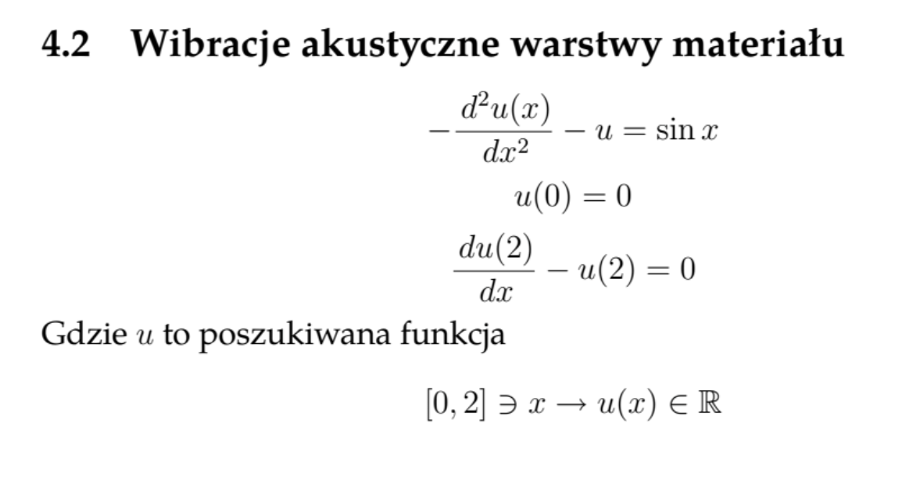

# Acoustic vibrations of the material layer FEM solution
Solution of the acoustic vibrations of the material layer in Python using FEM. This project was done on Differential and difference equations (Równania różniczkowe i różnicowe) course at AGH.

## The content of the task (in Polish)

## Example solution (n=700)
